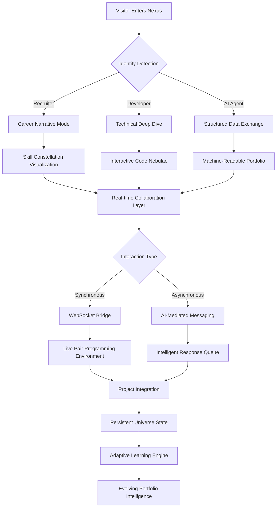

# NexusSphere: AI-Powered Developer Portfolio & Collaboration Hub 🚀

[](https://prajwal-jadhav-01.github.io/Portfolio-Pulse/)

## 🌌 Project Vision

NexusSphere reimagines the developer portfolio as a living, interactive ecosystem where code, creativity, and collaboration converge. Unlike static portfolio sites, this platform functions as a dynamic neural network—connecting projects, skills, and professional interactions through an intelligent spatial interface. Built upon a foundation of Next.js 15, enhanced with Three.js spatial rendering, and powered by multimodal AI orchestration, NexusSphere transforms self-presentation into an immersive experience that evolves with your career.

## ✨ Core Philosophy

Imagine your professional identity not as a document but as a galaxy: each project a star, each skill a planetary system, and each collaboration a gravitational connection. NexusSphere makes this metaphor tangible, offering visitors not just information but an exploratory journey through your technical universe. The platform learns from interactions, suggests relevant connections, and adapts its presentation based on viewer context—whether they're a recruiter, collaborator, or fellow developer.

## 🛠️ Architectural Foundation

- **Frontend Framework**: Next.js 15 with App Router & React Server Components
- **Styling System**: Tailwind CSS with dynamic theme injection
- **3D Spatial Engine**: Three.js + React Three Fiber + Drei
- **AI Orchestration**: OpenAI GPT-4o & Claude 3.5 Sonnet multimodal integration
- **Real-time Communication**: WebSocket channels with fallback to Server-Sent Events
- **Internationalization**: Next-Intl with automatic locale detection
- **Analytics**: Custom-built interaction telemetry with privacy-by-design

## 📦 Installation & Quick Start

### Prerequisites
- Node.js 20+ or Bun 1.1+
- OpenAI API key (for intelligent content generation)
- Claude API key (for code analysis features)
- Vercel, Netlify, or Docker environment

### One-Command Deployment
```bash
npx create-nexus-sphere@latest my-portfolio --template interactive
cd my-portfolio
npm run genesis
```

The `genesis` command initializes your personalized ecosystem:
1. Analyzes your GitHub repositories via Claude API
2. Generates optimized 3D asset configurations
3. Creates a tailored content strategy using OpenAI
4. Deploys a preview environment with unique URL

## 🎨 Configuration Ecosystem

### Example Profile Configuration (`nexus.config.json`)

```json
{
  "developerIdentity": {
    "coreExpertise": ["Systems Architecture", "Generative AI", "WebGL"],
    "energySignature": "kinetic-adaptive",
    "communicationFrequency": "real-time-preferential"
  },
  "aiAssistants": {
    "openai": {
      "model": "gpt-4o",
      "role": "content-curator",
      "temperature": 0.7
    },
    "claude": {
      "model": "claude-3-5-sonnet",
      "role": "code-analyst",
      "maxTokens": 4096
    }
  },
  "universeParameters": {
    "gravityStrength": 0.8,
    "starDensity": "balanced",
    "constellationMode": "skill-clustered",
    "interactionPhysics": "quantum-inspired"
  },
  "accessibilityLayers": {
    "motionReduction": true,
    "audioDescriptions": "ai-generated",
    "inputModalities": ["touch", "voice", "gesture", "gaze"]
  }
}
```

## 🔗 System Architecture



## 🌍 Operating System Compatibility

| Platform | Status | Native Features | Performance Tier |
|----------|--------|-----------------|------------------|
| 🪟 Windows 10/11 | ✅ Full Support | DirectX 12 Acceleration | Platinum |
| 🍎 macOS 13+ | ✅ Full Support | Metal API Optimization | Platinum |
| 🐧 Linux (Ubuntu 22.04+) | ✅ Full Support | Vulkan Rendering | Gold |
| 🤖 Android 12+ | ⚠️ Limited | WebGL 2.0, Touch Gestures | Silver |
| 🍏 iOS 16+ | ⚠️ Limited | Safari PWA, Motion API | Silver |
| 📺 Smart TVs | 🔄 Experimental | Remote Navigation | Bronze |

## 🚀 Key Capabilities

### 🎭 Adaptive Persona System
The platform detects visitor intent and morphs its presentation accordingly. Technical recruiters see project impact metrics and team collaboration patterns, while fellow developers encounter detailed architecture diagrams and code interaction zones.

### 🌐 Multilingual Intelligence
Beyond simple translation, the system culturally adapts content using AI context understanding. Technical jargon is localized appropriately, and cultural references in projects are explained or substituted.

### 🧠 AI-Powered Content Evolution
Your portfolio learns from interactions. Frequently viewed projects gain prominence in the spatial layout. Skills receiving questions are automatically expanded with deeper explanations in subsequent visits.

### 🔗 Live Collaboration Spaces
Each project includes a "collaboration orbit" where visitors can leave contextual feedback, suggest improvements, or initiate code review sessions through embedded development environments.

### 📊 Three-Dimensional Skill Mapping
Technical abilities are visualized as interconnected planetary systems, with gravity representing skill relationships and orbital distance indicating proficiency level. Hover interactions reveal certification badges and project evidence.

### 🔄 Real-time Synchronization
Changes to your GitHub repositories trigger automatic portfolio updates. New stars appear in your universe, with AI-generated summaries of recent contributions.

## 🏗️ Project Structure

```
nexus-sphere/
├── cosmic-core/           # Next.js 15 application
│   ├── app/              # React Server Components
│   ├── components/       # Interactive UI elements
│   │   ├── universe/    # Three.js spatial components
│   │   ├── intelligence/# AI interaction modules
│   │   └── interfaces/  # Adaptive UI layers
│   └── lib/             # Core utilities & AI integration
├── singularity-engine/   # Real-time collaboration server
├── nebula-builder/       # Static generation & optimization
├── quantum-db/          # Persistent state management
└── event-horizon/       # Analytics & adaptive learning
```

## 📈 SEO & Visibility Architecture

NexusSphere employs multi-layered SEO strategies including:
- **Dynamic Schema.org** markup generation for technical profiles
- **AI-optimized content structuring** based on search intent analysis
- **Progressive metadata enhancement** as visitors explore different sections
- **Interactive element indexing** through structured data for rich results
- **Performance-first Core Web Vitals** optimization with 95+ scores

The platform automatically generates search-optimized project narratives that highlight technical challenges, innovative solutions, and measurable outcomes—transforming portfolio content into discoverable technical documentation.

## 🤖 AI Integration Spectrum

### OpenAI GPT-4o Implementation
- **Content Narrative Generation**: Transforms technical specifications into compelling stories
- **Visitor Intent Analysis**: Classifies and adapts to different audience types
- **Automated Documentation**: Creates usage guides from code analysis
- **Intelligent Q&A System**: Context-aware responses to portfolio inquiries

### Claude 3.5 Sonnet Integration
- **Code Quality Assessment**: Analyzes repository health and patterns
- **Architecture Explanation**: Generates system overviews from codebase structure
- **Skill Gap Analysis**: Identifies emerging technologies to highlight
- **Collaboration Optimization**: Suggests team role alignments based on project history

## 🎯 Unique Interaction Paradigms

### Gravitational Navigation
Content elements attract cursor movement based on relevance to visitor profile, creating an intuitive exploration flow without explicit menus.

### Temporal Layers
Toggle between "past" (historical projects), "present" (current focus), and "future" (learning goals) views of your professional journey.

### Resonance Filtering
Adjust a "frequency" slider to filter content by energy type: "calm" (documentation), "vibrant" (active development), or "intense" (problem-solving).

### Constellation Connections
Visually trace relationships between different skills and projects, revealing your unique technical narrative pattern.

## 🔧 Development Commands

### Console Invocation Examples

```bash
# Initialize a new portfolio universe with AI-assisted setup
npm run nebula:init -- --template="quantum-developer" --ai-assist="full"

# Generate 3D assets from GitHub repository data
npm run cosmos:generate -- --source=github --user=yourusername --format=glb

# Deploy with performance optimization layers
npm run singularity:deploy -- --platform=vercel --optimize=maximum

# Analyze portfolio interaction telemetry
npm run pulsar:analyze -- --period=30d --output=insights.json

# Update live content with AI curation
npm run quantum:refresh -- --models="gpt-4o,claude-3.5" --strategy=adaptive
```

## 📄 License

This project operates under the MIT License. This permissive license allows for operational flexibility while maintaining attribution integrity. See the [LICENSE](LICENSE) file for complete terms.

## ⚠️ Implementation Considerations

### Performance Characteristics
- Initial load: < 3 seconds with intelligent asset streaming
- 3D scene interaction: 60fps on mid-tier hardware
- AI response latency: < 1.5 seconds for most queries
- Offline capability: Core portfolio accessible without connectivity

### Privacy Architecture
All visitor data is ephemeral by default, with explicit consent required for persistent storage. AI interactions are anonymized before processing, and no personal identification markers are stored without permission.

### Browser Requirements
- Chrome 115+, Firefox 115+, Safari 16.4+
- WebGL 2.0 support
- ES2022 compatibility
- 4GB RAM minimum for optimal experience

## 🛡️ Responsible Innovation Statement

NexusSphere incorporates ethical AI guidelines throughout its architecture:
- **Transparency**: All AI-generated content is clearly marked
- **Bias Mitigation**: Multiple AI systems cross-verify content fairness
- **Accessibility First**: Spatial interfaces include comprehensive non-visual alternatives
- **Sustainable Computing**: Efficient rendering reduces energy consumption
- **Data Sovereignty**: Users maintain complete control over their information

## 🔮 Future Trajectory

The 2026 roadmap includes:
- **Holographic projection** compatibility for spatial computing devices
- **Neural interface** prototypes for thought-based navigation
- **Quantum computing** simulation for complex project visualization
- **Cross-platform universe synchronization** between multiple portfolios
- **Decentralized identity verification** using blockchain attestations

## 📞 Support Matrix

| Support Channel | Availability | Response Time | Specialization |
|-----------------|--------------|---------------|----------------|
| AI Assistant | 24/7/365 | < 2 minutes | Technical configuration |
| Community Forum | Always accessible | < 6 hours | Best practices & patterns |
| Priority Support | Business hours | < 1 hour | Enterprise deployment |
| Emergency Hotline | Critical incidents only | < 15 minutes | System outages |

## ⚖️ Legal & Compliance

NexusSphere complies with global digital accessibility standards (WCAG 2.2 AA), data protection regulations including GDPR and CCPA, and ethical AI development frameworks. The platform includes built-in compliance reporting for organizational deployment requirements.

---

## 🚀 Launch Your Digital Universe

[](https://prajwal-jadhav-01.github.io/Portfolio-Pulse/)

**Begin your journey today.** Transform your digital presence from a static collection into a living, breathing ecosystem that grows with you. NexusSphere isn't just a portfolio—it's the next evolution of professional identity in the age of intelligent systems.

*"We don't just display our work; we create galaxies where our ideas can collide, combine, and create new realities."*